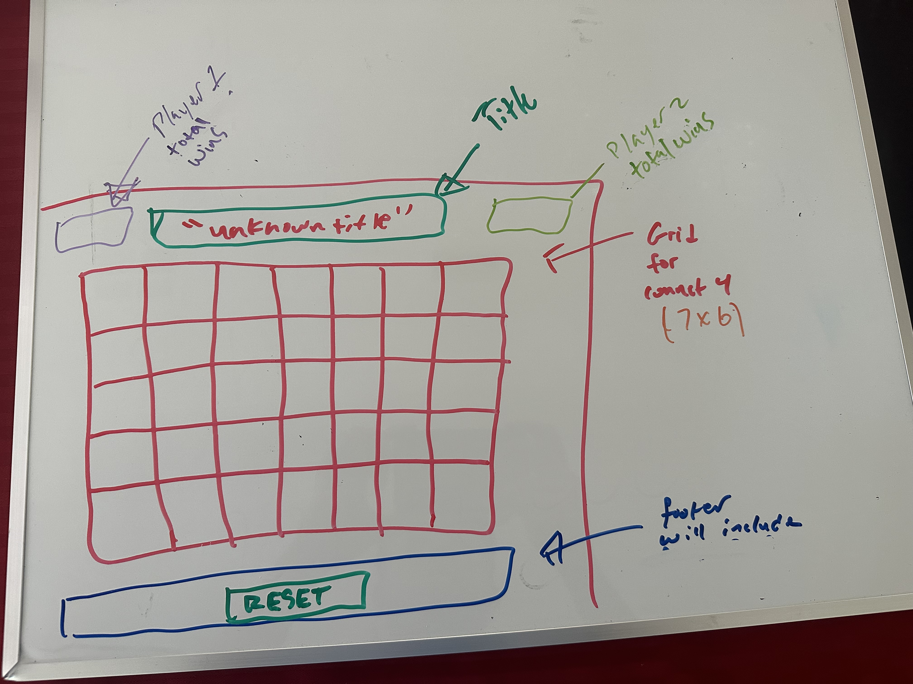

# Connect Four!

## Background
- Game Choice: Connect Four

## Wireframe


### PseudoCode
```
Create a function that alternates players moves

create a function button that will reset the game

create a win condition when either player connects 4 

create a tie condition when board is filled and neither player connected 4

create a function if grid point is already occupied with either players game piece it cannot be changed.

create a function for a 'tally' system for both player total wins

create a input so players can enter names instead of player 1 and 2

```
